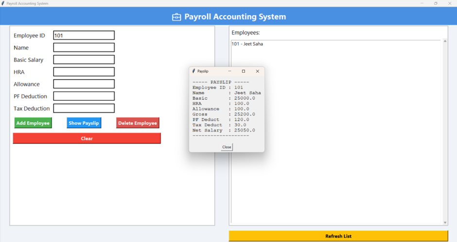

# 💼 Payroll Accounting System

---

## 🧾 Abstract

The **Payroll Accounting System** is an intelligent desktop application designed to automate the process of managing employee salary records, deductions, and payslips.  
Traditional payroll handling involves tedious manual calculations and record-keeping — this system replaces that with a **smart, efficient, and user-friendly** interface that ensures data accuracy, speed, and transparency.

---

## 🚀 1. Introduction

Payroll management is one of the most crucial tasks in any organization.  
Manual payroll systems are often slow, error-prone, and lack security.

The **Payroll Accounting System** automates the entire process by:
- Maintaining structured employee records  
- Calculating gross and net salaries automatically  
- Generating and displaying payslips dynamically  
- Saving data securely to a database  

Built with **Python and Tkinter**, it offers a visually appealing and intuitive user experience.

---

## 🎯 2. Objectives

- ✅ Automate salary calculation (basic pay, allowances, and deductions)  
- ✅ Reduce manual calculation errors  
- ✅ Maintain all employee data in a structured digital database  
- ✅ Generate professional-style payslips automatically  
- ✅ Improve efficiency, accuracy, and security in payroll operations  

---

## 🧠 3. System Overview

### 🧩 Modules

#### 🧍 Employee Management Module
- Add, update, search, and delete employee records  
- Store employee details like ID, name, designation, and joining date  

#### 💰 Salary Calculation Module
- Automatically calculates gross and net salaries  
- Handles HRA, allowances, PF, and tax deductions  
- Formula used:  
Net Salary = Basic + Allowances - Deductions

yaml
Copy code

#### 🧾 Payslip Generation Module
- Instantly creates detailed payslips  
- Provides summary reports for accounting or audits  

#### 🧑‍💼 Admin Control Module
- Enables secure data management  
- Provides database backup and recovery options  

---

## ✨ 4. Key Features

| Feature | Description |
|----------|-------------|
| ⚙️ Automated Calculations | Ensures error-free salary computation |
| 👥 Employee Data Management | Centralized digital records |
| 📊 Dynamic Reports | Real-time payroll summaries |
| 🔒 Data Security | Stored in SQLite database |
| 💻 User-Friendly UI | Clean and modern Tkinter interface |
| ⏱️ Time Efficient | Reduces repetitive manual work |
| 📈 Scalable | Easily handles hundreds of employees |
| 🧩 Backup & Recovery | Prevents data loss through database persistence |

---

## 🖥️ 5. Interface Preview

Below is a screenshot of the application interface showing the employee form, payroll list, and payslip popup:

---

## 🌟 6. Specialties

This system stands out because it’s:
- 🧮 **Fully automated** — zero manual calculation errors  
- ⚡ **Dynamic & Customizable** — modify tax, PF, and salary structures easily  
- 🔐 **Multi-user supported** — suitable for HR & Finance departments  
- 💡 **Cost-effective** — built using open-source Python tools  
- 🌱 **Eco-friendly** — promotes paperless payslip generation  

It’s the perfect bridge between **traditional payroll processing** and **modern digital automation**.

---

## 🧰 7. Technologies Used

| Component | Technology |
|------------|-------------|
| Frontend | Tkinter (Python GUI Toolkit) |
| Backend | Python 3 |
| Database | SQLite3 |
| IDE/Editor | Visual Studio Code |
| Styling | Custom Tkinter theme with color gradients |

---

## 🏗️ 8. System Architecture

The system follows a **three-tier architecture**:

1. **Presentation Layer (GUI):**  
 Handles all user input and visualization.

2. **Application Layer (Logic):**  
 Processes salary computation, validation, and payslip generation.

3. **Data Layer (Database):**  
 Handles permanent employee and payroll record storage.

---

## ⚡ 9. Advantages

- 🧮 Eliminates human error  
- 💾 Maintains secure, consistent data  
- 📈 Increases productivity and transparency  
- 💸 Saves time and operational costs  
- 🧍 Easy access to all salary histories  

---

## 🔮 10. Future Scope

The Payroll System can be expanded with:
- 🤖 **AI-based salary prediction & anomaly detection**  
- ⏱️ **Integration with biometric/RFID attendance systems**  
- ☁️ **Cloud-based remote payroll access**  
- 💬 **Chatbot assistant for employees**  

---

## 🏁 11. Conclusion

The **Payroll Accounting System** offers a robust, efficient, and user-friendly solution for payroll management.  
It transforms traditional manual payroll handling into a **modern automated workflow**, ensuring accuracy, transparency, and ease of operation for any organization.

---

## 📸 Author
**Developed by:** [Jeet Saha](mailto:jeet2022saha@gmail.com)  
🎓 Student | AI & Data Science Enthusiast  
💡 Passionate about building intelligent software systems
